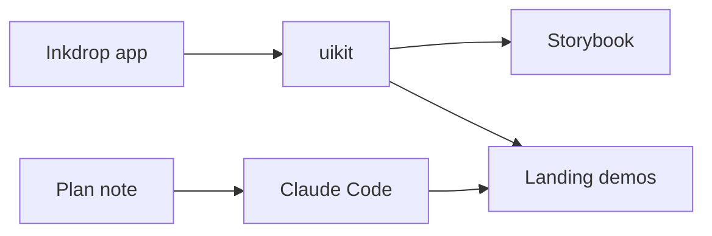

# Brief: yt-talks — 2026-09-16

**Topic:** `yt-talks`  
**Skill:** `yt-talks-summarizer`  
**Mode:** manual

## Source (attribution)

| Field | Value |
|-------|--------|
| **Watch URL** | https://www.youtube.com/watch?v=9y65wHtMTAo |
| **Title** | How I designed my SaaS landing page using AI tools |
| **Channel / speaker** | Takuya Matsuyama (craftzdog) / Inkdrop |
| **Published** | not verified this run (companion blog dated Sep 2026) |
| **Accessed** | 2026-09-16 |
| **Purpose** | personal study / curriculum research |
| **Caption source** | YouTube captions (en) |

## Optional quotes (max 2, ≤15 words each)

- “taste slop” (speaker’s label for generic Claude-looking sites)

## 1. Identify the talk

- **Problem:** Ship a new Inkdrop landing page that explains the product, stands out, and includes a tryable demo without unmaintainable spectacle.
- **Audience:** Solo/indie SaaS builders and devs using AI agents on marketing sites.
- **Domain:** Web product design, AI design tools, React component reuse (Electron → web).
- **Type:** experience report + workflow tips.

## 2. Core thesis

The speaker discarded several AI-generated visual directions, then chose a **simple** layout (inspired by Sketch, Fly.io, Stripe) paired with **real app components** in the page and synced background footage—not static mocks. Implementation relied on extracting a shared `uikit`, Storybook, Inkdrop-based phased plans, and Claude Code guided by file references and tight bug reports. A separate video covers the Waku + CodeMirror editor demo; this talk is mostly design exploration and prompting habits.

## 3. Technical concepts

| Concept | How the speaker uses it |
|---------|-------------------------|
| Inkdrop | Electron notes app whose UI can run in the browser for demos |
| UIKit | Shared React library split from the desktop app for site parity |
| Storybook | Ground truth for components (e.g. realistic sidebar layouts) |
| Claude Code | Agent that implements phases from plan notes |
| v0 | Worked for a TOTP form; weak for full landing |
| GPT Images 2.0 | Rapid visual concepts later handed to Claude Design |
| Claude Design | Image-to-layout; layout and copy issues |
| awesome-design-md | Brand-reference generator; felt generic |
| Waku / CodeMirror | Interactive typing demo stack (other video) |
| Radix-style patterns | Structure for extracted components |
| CSS transform scale | Responsive demo framing; suspected mobile bug |
| `backdrop-filter` | Android blur issues reported to the agent |
| Inkdrop plan templates | MCP-filled implementation plans by phase |

## 4. Reconstruct the system

Desktop app UI is refactored into **UIKit** → validated in **Storybook** → embedded in **landing demo frames** (sidebar, lists, editor). Masthead combines **recorded composition footage** with a **live editor** so visitors see sync plus interaction. The agent loop: plan note → phase N → human review/commit → plan updates when surprises appear.

## 5. Engineering decisions

**Decision:** Favor simple marketing sites over animation-heavy portfolio clones.  
**Why:** Flashy mocks hid product purpose; hard to update when app UI changes.  
**Alternatives:** Three.js hero effects; full Oğuz-style clones.  
**Trade-off:** Less visual punch vs clearer story and maintainability.  
**Result:** References Sketch / Fly.io / Stripe as models.

**Decision:** Live components + editable editor instead of screenshots/video only.  
**Why:** Browser-capable Electron UI can be tried on the page.  
**Alternatives:** Video-only demos like native-app landings.  
**Trade-off:** Large extraction/refactor effort.  
**Result:** Speaker credits agents for making the refactor tractable.

**Decision:** Background footage behind synced demo for channel branding.  
**Why:** Signal “my product” to YouTube visitors without on-page face/channel names.  
**Alternatives:** Explicit channel branding assets.  
**Trade-off:** Extra production work.  
**Result:** Two intentional surprise moments that still explain the product.

**Decision:** Phased plans in Inkdrop notes, not one-shot page generation.  
**Why:** Control scope; record new decisions as work proceeds.  
**Alternatives:** Single mega-prompt to build entire site.  
**Trade-off:** Slower than blind codegen.  
**Result:** Iterative sections (e.g. static frame before scenes).

**Decision:** Reference repo paths (stories, docs, images) instead of pasting code into chat.  
**Why:** Agent aligns with working desktop behavior.  
**Alternatives:** Prose-only UI descriptions.  
**Trade-off:** Requires organized repo and docs.  
**Result:** Workspace demo built from named Storybook stories.

## 6. Numbers

- Speaker cites **~115,000** GitHub stars for awesome-design-md (verify independently if needed).
- **none in captions** for traffic, conversion, or performance metrics.

## 7. Trade-offs

- AI image tools: fast ideation vs off-brand or broken layouts.
- Reference-design generators: safe corporate look vs unique product identity.
- Real UI demos: clarity and trust vs CSS/mobile edge cases and refactor cost.
- Phased agent work: codebase quality vs speed of “generate everything.”

## 8. Fact vs opinion

| Statement (paraphrase) | Label |
|------------------------|--------|
| Mobile demo frame rotated on iPhone; negative scale suspected | observed symptom + hypothesis |
| awesome-design-md ~115k stars | stated number (verify) |
| v0 landing attempts felt boring | speaker opinion |
| Claude sites share a similar aesthetic | speaker opinion |
| Two “wow” moments aid understanding | speaker opinion |
| UIKit split would be too heavy without agents | speaker opinion |

## 9. Context

- **Workload:** Marketing site with multiple interactive demo sections.
- **Scale:** Solo / indie maintainer.
- **Hardware:** iPhone and Android mentioned for layout/blur bugs.
- **Software version:** Inkdrop v6 mentioned in design experiments; exact pins **unknown**.
- **Assumptions:** Visitors benefit from hands-on UI; YouTube audience should recognize product subtly.
- **Constraints:** Maintain when app UI changes; avoid whole-page blind generation.

## 10. Generalizable lessons

- **Broad:** Use AI design for **direction finding**, then commit to simple storytelling plus **real** UI where possible. Agents need **plans, pointers, and QA-shaped reports**, not megaprompts.
- **Specific:** Inkdrop uikit + Storybook + Inkdrop MCP plans; footage sync branding; Waku demo is a separate artifact.

## 11. Uncertainty

- Auto-captions; slide details not seen.
- Upload date not re-fetched this run.
- Deep Waku/CodeMirror steps live in linked video `Rt7xwb1SOcY`.

## 12. Actionable notes

- **Remember:** Static skeleton → then motion; “work on phase N” after reviewing a plan note.
- **Investigate next:** Shared UIKit pattern if app and marketing share React; demo scaling CSS on real phones.
- **Learn (tech/docs):** Storybook realistic stories; agent workflows with repo-relative references.
- **Design questions:** Can a visitor **try** the product in one scroll? What breaks when app UI ships weekly?
