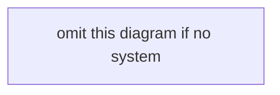

# Brief: yt-talks — {YYYY-MM-DD}

**Topic:** `yt-talks`  
**Skill:** `yt-talks-summarizer`  
**Mode:** manual  
**Video:** {id}  
**Title:**  
**Channel / event:**  
**Published:**  
**Caption source:** YouTube captions ({lang}) | blocked  
**Link:** https://www.youtube.com/watch?v={id}

## 1. Identify the talk

- **Problem:**
- **Audience:**
- **Domain:**
- **Type:** architecture | implementation | research | operations | product | experience report

## 2. Core thesis

{2–5 sentences.}

## 3. Technical concepts

| Concept | How the speaker uses it |
|---------|-------------------------|
| | |

## 4. Reconstruct the system

{Components, data flow, control flow, dependencies, interfaces, scaling boundaries, failure points — or **none in captions**.}

## 5. Engineering decisions

**Decision:**  
**Why:**  
**Alternatives:**  
**Trade-off:**  
**Result:**

{Repeat per decision. Or **none in captions**.}

## 6. Numbers

{Only values spoken or shown in description. Never invent. Or **none in captions**.}

## 7. Trade-offs

- {X vs Y / bottleneck / downside — or **none in captions**.}

## 8. Fact vs opinion

| Statement (paraphrase) | Label |
|------------------------|--------|
| | observed result / measured result / architectural choice / speaker opinion / recommendation / hypothesis |

## 9. Context

- **Workload:**
- **Scale:**
- **Hardware:**
- **Software version:**
- **Assumptions:**
- **Constraints:**

{**unknown** if not spoken.}

## 10. Generalizable lessons

- **Broad:**
- **Specific to their environment:**

## 11. Uncertainty

- {ASR errors, missing slides, guesses not made}

## 12. Actionable notes

- **Remember:**
- **Investigate next:**
- **Learn (tech/docs):**
- **Design questions:**
